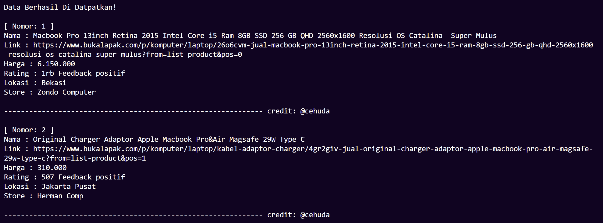

# Tokopedia Web Scraping

Tokopedia Web Scraping is a Python script designed to extract product data from the popular Indonesian e-commerce platform, Tokopedia. This tool utilizes the power of Selenium and BeautifulSoup to automate the data collection process, making it easy to gather information about products of interest.

## Prerequisites

Before you get started, ensure that you meet the following requirements:

- Python 3.x
- ChromeDriver
- Selenium
- BeautifulSoup

## Installation

Getting up and running is a straightforward process:

1. Clone this repository to your local machine:

   ```
   git clone https://github.com/cehuda/tokopedia-scraping.git
2. Install the necessary Python packages:
   
   ```
   pip install selenium beautifulsoup4
4. Download ChromeDriver and place it in the project directory.

# Usage

Using the Tokopedia Web Scraping tool is as simple as running a Python script:

1. Execute the script:

    ```
    python tokopedia_scraper.py
2. Follow the prompts to enter the product name and page number you wish to scrape.

3. Sit back and let the script do the work for you.

# Output


The scraped product data will be displayed in your console, allowing you to view, analyze, or save it to a file for further use.
Credits

This script was originally created by @cehuda. We extend our gratitude for their valuable contribution.
License

Tokopedia Web Scraping is released under the MIT License. For more details, please refer to the LICENSE file.
